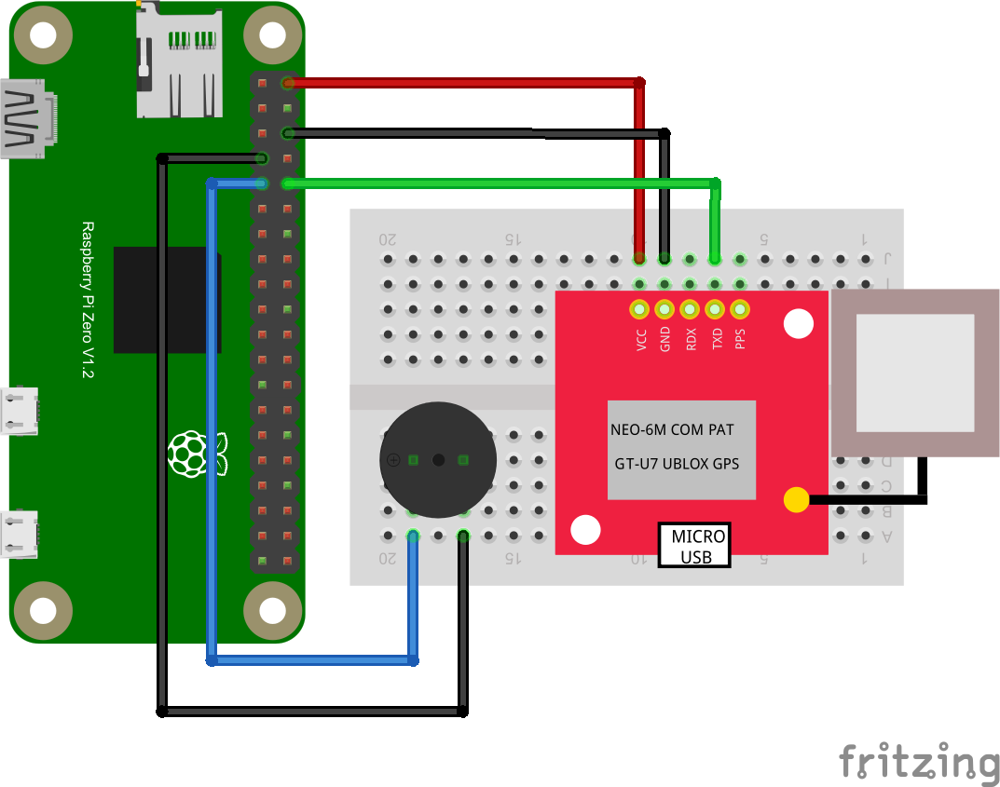

# Raspberry Pi Speed Camera Alert 
This repository contains code for a GPS tracker built using a Raspberry Pi and a NEO-6M GPS module. It designed for a very specific niche - to send an automatic alert when approaching one of the many new speed cameras set up in my city, where I'm typically driving without the use of Google Maps and its speed camera alerts. The Raspberry Pi runs automatically whenever the car is on.

The tracker uses the [rpio library](https://github.com/jperkin/node-rpio) to read data from the GPS module, compare it to a short list of known speed cameras, and beep when the vehicle is approaching one of them.

The code is written in Node.js and is intended to be run on a Raspberry Pi Zero W. The code would probably work better on more capable Raspberry Pi models, but it seems to run fine on the $10 model I picked up from Microcenter.

## Hardware
The GPS tracker uses the following hardware:
  - [Raspberry Pi Zero W](https://www.raspberrypi.com/products/raspberry-pi-zero-w/), [Raspberry Pi Zero 2 W
](https://www.raspberrypi.com/products/,raspberry-pi-zero-2-w/), or other Raspberry Pi model. 
  - [NEO-6M GPS module](https://www.amazon.com/gp/product/B0B31NRSD2)
  - Piezo buzzer

## Installation
1. Get your Pi up and running with the stock Raspberry Pi OS (Debian) by following the [official instructions](https://www.raspberrypi.com/documentation/computers/getting-started.html).
2. Log into your Pi and make sure everything is running. You could do this by connecting all the peripherals, but it is much easier to remote into it using [SSH](https://www.raspberrypi.com/documentation/computers/remote-access.html).
3. Connect the hardware as shown in the diagram below.

    - The buzzer connects to the RPi GPIO pin 7 and GND.
    - The GPS module can be connected using two methods:
      1. The easy way: Connect the two using a [USB OTG cable](https://www.amazon.com/gp/product/B00N9S9Z0G/). I started with this method and it worked right out of the box. However, the cable took up too much space in the small enclosure I had and I connected them directly to the Pi using the second method.
      2. The harder way: Connect directly to the Pi using the pins below, also shown in the diagram above. Check out [this helpful article](https://sparklers-the-makers.github.io/blog/robotics/use-neo-6m-module-with-raspberry-pi/) on how to do this using a similar GPS module.
          - Neo-6M VCC -> RPi 5v
          - Neo-6M GND -> RPi GND
          - Neo-6M TX  -> RPi RX (GPIO 15)
4. Install Node.js by following [these instructions](https://hassancorrigan.com/blog/install-nodejs-on-a-raspberry-pi-zero/). In hindsight I should have just written this in Python, but wanted to knock this out quickly and knew I could do it faster in Node. If I have time, I'll rewrite it in Python.
5. Clone this repository to your Pi and install dependencies:
```bash
git clone https://github.com/timmhayes/pi-speed-camera-alert
cd pi-speed-camera-alert
npm install
```

## Configuration
1. Edit the `config.js` file to configure the GPS tracker. The default settings should work fine if you've set up your Pi following the wiring diagram above. If you've connected to the GPS using the USB OTG cable, you'll need to change the `gps.path` setting to `/dev/ttyACM0`. You can also run this code with test data on a normal laptop by setting `gps.mockdata` and `buzzer.mockhardware` to `true`.
2. Add the locations you want to track to the <a href="./data/cameras.json">./data/cameras.json</a> file. The `name` property is just for your reference, and the `lat` and `lng` properties are the GPS coordinates of the speed camera. You can find the GPS coordinates of a location by searching for it on [Google Maps](https://www.google.com/maps) and right-clicking on the location to get the coordinates. You can also use [this tool](https://www.latlong.net/convert-address-to-lat-long.html) to get the coordinates of a location. The `direction` property should be set to the 360-degree cardinal direction indicating the direction of travel. This is used to determine whether the vehicle is approaching or leaving the speed camera. The properties for `type`, `limit`, and  `specialLimit` are reserved for future use but are not currently used.


## Usage
To start the GPS tracker, run the following command:
  ```bash
  node index.js
  ```
The tracker will start reading data from the GPS module and beep for the following events:
 - On startup: Two short beeps once satellite data is being recieved.
 - When nearing a tagged location: Three short beeps.
 - When passing a tagged loction: One long beep.
 
 The tracker will continue to run until you stop it by pressing `Ctrl+C`.
 
 ### Automatic Startup

To get the app to run on startup, you can add the following line to the `/etc/rc.local` file:
```bash
node /home/pi/pi-speed-camera-alert/index.js &
```
Read this SparkFun article on [How to Run a Raspberry Pi Program on Startup](https://learn.sparkfun.com/tutorials/how-to-run-a-raspberry-pi-program-on-startup/all#method-1-rclocal) for more information on how to do this.

### Shutdown Warning
This was designed as a simple device to run in my car, booting up when I start the car and shutting down when I turn it off. However the Raspberry Pi is not designed to be powered on and off like this, and it is possible to corrupt the SD card if you do this too often. I plan to clone the SD card and keep a backup in case this happens. You could also add a button to shut it down gracefully before turning off the car.

## The Final Product:
The final product, packed into a nice little Fisher Space Pen box:
